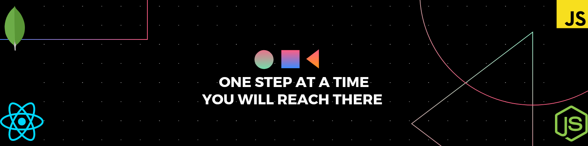

<h1 align="center">Hi 👋, I'm Ajnas N B</h1>
<h3 align="center">A passionate full stack developer from India</h3>

  

- 🔭 I’m currently working on **opensource projects**

- 🌱 I’m currently learning **web2 and web3 frameworks**

- 👯 I’m looking to collaborate on **different django projects**

- 🤝 I’m learning and looking for help with **various web3 frameworks**

- 👨‍💻 All of my projects are available at [ajnasnb.me](ajnasnb.me)

- 📝 I sometimes write articles on [blog.ajnasnb.me](blog.ajnasnb.me)

- 💬 Ask me about **javascript ,react , nodejs**

- 📫 How to reach me **ajnasnb@gmail.com**

- ⚡ Fun fact: **I'm not at all funny😉😉**

## 🌐 Socials:
  

# 💻 Tech Stack:
                     
# 📊 GitHub Stats:
 
 

## 🏆 GitHub Trophies

### ✍️ Random Dev Quote

